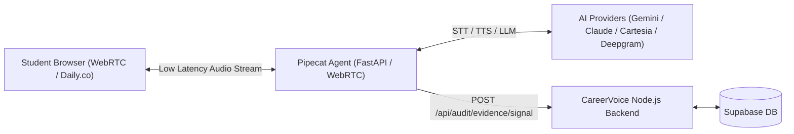

# Pathwisse CareerVoice - Pipecat Multi-Model Voice Agent

Production-ready, real-time multimodal conversational AI agent for **Pathwisse CareerVoice** built on top of [Pipecat](https://github.com/pipecat-ai/pipecat).

Designed for ultra-low latency (<300ms) WebRTC voice audits with **multi-model fallback across Google Gemini, Anthropic Claude, and OpenAI GPT-4o**.

---

## ⚡ Key Features

- **Multi-Model LLM Resilience**:
  - **Primary**: Google Gemini 1.5 Flash
  - **Fallback 1**: Anthropic Claude 3.5 Sonnet
  - **Fallback 2**: OpenAI GPT-4o-mini
- **Ultra-Low Latency Audio Stack**:
  - **STT**: Deepgram Nova-2 (real-time streaming transcription)
  - **TTS**: Cartesia Sonic (<100ms ultra-low latency voice synthesis)
  - **VAD & Interruption**: Silero VAD (instant barge-in detection)
- **Deterministic CareerVoice Integration**:
  - Automatically posts extracted candidate claims & skills asynchronously to CareerVoice's backend (`POST /api/audit/evidence/signal`).
- **Turnkey AWS Deployment**:
  - Ready for **AWS App Runner** or **AWS ECS Fargate** via automated CI/CD and 1-click deployment scripts.

---

## 🚀 Architecture



---

## 🛠️ Local Development

### 1. Prerequisites
- Python 3.11+
- Daily.co, Deepgram, Cartesia, and Gemini API keys

### 2. Setup
```bash
# Clone the repository
git clone https://github.com/MahammadWahab540/pathwisse-careervoice-pipecat.git
cd pathwisse-careervoice-pipecat

# Create virtual environment
python -m venv .venv
source .venv/bin/activate  # On Windows: .venv\Scripts\activate

# Install dependencies
pip install -r requirements.txt

# Copy environment variables
cp .env.example .env
```

### 3. Run the Voice Server
```bash
python server.py
```
The server will start on `http://localhost:8000`.

Check health:
```bash
curl http://localhost:8000/health
```

---

## ☁️ Deploying to AWS (AWS App Runner)

### Automated 1-Click Deployment
```bash
# Using PowerShell (Windows)
cd deploy
.\deploy-apprunner.ps1 -Region ap-south-1

# Using Bash (Linux / macOS / AWS CloudShell)
cd deploy
chmod +x deploy-apprunner.sh
./deploy-apprunner.sh
```

---

## 🔄 GitHub Actions CI/CD

Add the following GitHub Secrets to your repository (`Settings -> Secrets and variables -> Actions`):
* `AWS_ACCESS_KEY_ID`
* `AWS_SECRET_ACCESS_KEY`
* `AWS_REGION` (`ap-south-1`)

Pushing to `main` automatically builds the Docker container, pushes to Amazon ECR, and deploys to AWS App Runner.
